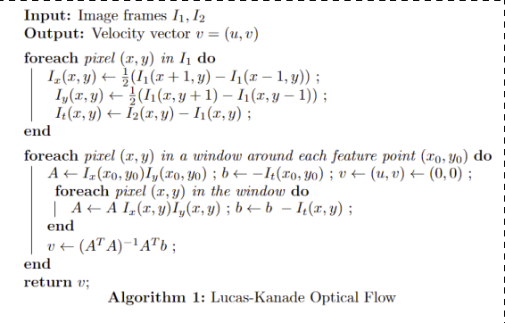
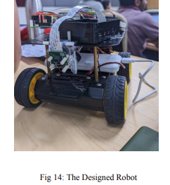

# VelocityEstimation-OpticalFlow
# Optical Flow Analysis and Hardware Implementation on Robot Rover

## Project Overview

This project combines classic optical flow algorithms (Lucas-Kanade and Farneback) and a deep learning approach (RAFT) for vehicle speed estimation. Implemented on a robot rover equipped with Raspberry Pi 4, Pi Camera, and a custom-built mobile platform, the project explores the integration of computer vision techniques in real-world scenarios.

## Table of Contents
1. [Introduction](#1-introduction)
2. [Algorithms](#2-algorithms)
    - [Lucas-Kanade](#21-algorithm-overview---lucas-kanade)
    - [Farneback](#22-algorithm-overview---farneback-gunnar)
    - [RAFT](#23-raft)
    - [YOLO](#24-yolo)
3. [Results](#3-results)
4. [Hardware](#4-hardware)
5. [Live Demo](#5-live-demo)
6. [Future Work](#6-future-work)
7. [Challenges](#7-challenges)

---

## 1. Introduction

The project addresses the critical need for accurate vehicle speed estimation in autonomous vehicles. Optical flow algorithms, both classic and deep learning-based, are applied to video data from onboard cameras. The focus is on practical implementation, including a hardware setup on a robot rover, making the project applicable to real-world scenarios.

---

## 2. Algorithms

### 2.1 Algorithm Overview - Lucas-Kanade

Lucas-Kanade, a sparse optical flow algorithm, tracks feature points between frames. The paper details steps for car velocity estimation, including feature extraction, optical flow calculation, and unit conversion.

### 2.2 Algorithm Overview - Farneback Gunnar

Farneback Gunnar, a dense optical flow algorithm, estimates flow for every pixel. The process involves grayscale conversion, derivative computation, structure tensor creation, and optical flow computation.

### 2.3 RAFT

Recurrent All-Pairs Field Transforms (RAFT), a deep network architecture, produces multi-scale 4D correlation volumes for pixel pairs, extracting per-pixel characteristics. The method is divided into three stages: feature extraction, visual similarity computation, and iterative updates.

### 2.4 YOLO

You Only Look Once (YOLO), a real-time object detection system, is integrated into the pipeline for identifying cars and providing bounding boxes for Region of Interest (ROI) determination.

---

## 3. Results

The project showcases results from Lucas-Kanade, Farneback, and RAFT, including optical flow, feature points, and motion vectors. Live demo results and YOLO integration for ROI determination are presented.

---

## 4. Hardware

A mobile robot, powered by Raspberry Pi 4, Pi Camera, and a custom-built platform, is designed for video recording and analysis. The section covers hardware specifications, video streaming details, and challenges faced during implementation.

---

## 5. Live Demo

Live demo results, including video links and real-time optical flow analysis, are provided, offering recruiters a hands-on perspective of the project.

---

## 6. Future Work

The project suggests potential avenues for future work, including implementing a robot tracking system, improving velocity calculations, modifying RAFT for real-time output, and extending the method for tracking multiple cars.

---

## 7. Challenges

This section outlines challenges faced during the project, demonstrating problem-solving skills and the ability to overcome obstacles.

---

**Conclusion:**

This comprehensive README provides a structured overview of the project, emphasizing practical implementation on a robot rover. The combination of classic and deep learning-based optical flow algorithms, coupled with a detailed hardware setup, positions this project as a valuable asset for researchers and practitioners in the field.
